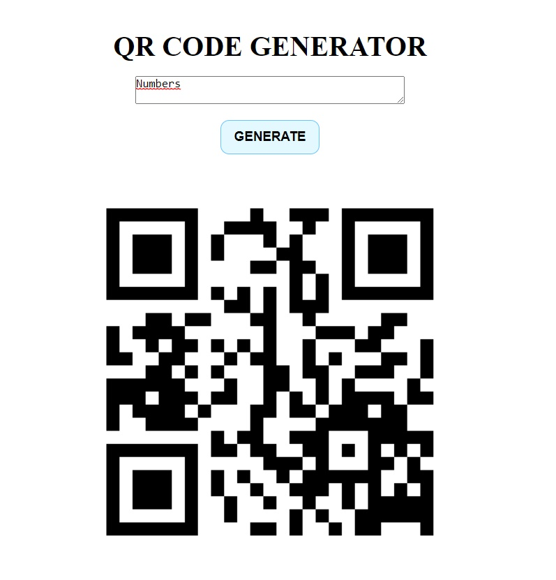

# QR Code Generator using Google Charts API

This project is a simple web application that generates QR codes using the Google Charts API. It allows users to enter text and generate a QR code image based on the input.

## Usage

1. Enter the text you want to convert into a QR code in the textarea provided.
2. Click the "GENERATE" button.
3. The QR code image will be displayed below the button.

## Technologies Used

- HTML
- CSS
- JavaScript

## preview 
https://yannakode.github.io/QRCode-generator/
